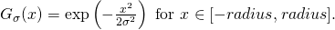
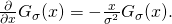
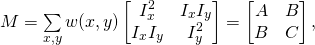
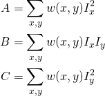
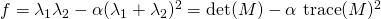
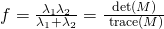
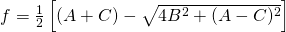

# Step 2: Implement a corner feature detector
Now, lets implement our corner detector!

## 1. Implement the filter kernels
Study how we have written `create1DGaussianKernel()` in [common_lab_utils.py](../common_lab_utils.py). 
This function takes a standard deviation and an optional filter radius to produce a filter kernel that samples and normalizes the Gaussian function

Follow our implementation of `create1DGaussianKernel()` to implement the derivated Gaussian kernel `create1DDerivatedGaussianKernel()` in [lab-corners.py](../lab_corners.py).
The derivative of a Gaussian is given by

Hint: Use `create1DGaussianKernel()` to create the derivated kernel according to the formula above!

Check that your implementation returns the correct result, for example by printing the result to the console. 
When the kernel looks reasonable, we are ready to implement `CornerDetector`.

## 2. Compute the image gradients
Get an overview of the class `CornerDetector` in [lab-corners.py](../lab_corners.py). 
What corner metrics are supported by the detector?

In `CornerDetector`, we have available the private members `self._g_kernel` and `self._dg_kernel`, constructed from the filter kernel functions we implemented above (see the implementation of the constructor).

Go to `CornerDetector.detect()`.

Recall from the earlier lecture about image filtering that we can apply a linearly separable 2D filter by convolving an image with each of the two corresponding 1D filter components consecutively. 
Also recall that we can estimate the image gradients in noisy images by convolving with a filter that corresponds to a derivated Gaussian in one direction, and a Gaussian in the other.

Use the 1D filter kernels in `self._g_kernel` and `self._dg_kernel` to compute the 2D gradient images *I*x and *I*y by using the OpenCV function [cv::sepFilter2D](https://docs.opencv.org/4.5.5/d4/d86/group__imgproc__filter.html#ga910e29ff7d7b105057d1625a4bf6318d).

Hint: Use the commented code.

Run the code. 
Since `self._visualize` should be `True`, you should be able to inspect the gradient images, and check that they look reasonable.

## 3. Compute *M* implicitly by computing *A*, *B* and *C*
Recall from the lectures that

where

and *w(x, y)* is a Gaussian windowing function.
The *A*, *B* and *C* images have the same size as the gradient images (and the original image).

First, compute the unwindowed version of images *A*, *B* and *C* by performing element-wise multiplication on the correct gradient images.

Then, convolve these images with the Gaussian windowing filter. 
Use the 1D kernel given in the private member `self._win_kernel`, and perform separable filtering as we did above.

Run the code, and check that the results look reasonable.

## 4. Implement the corner metrics
We are now ready to compute the metrics for cornerishness!

Recall the following corner metrics from the lecture:
- **Harris**:
  
  
  
- **Harmonic mean**:
  
  
  
- **Minimum eigen value**:
  
  
  
Implement these metrics in the static member functions `CornerDetector._harris_metric()`, `CornerDetector._harmonic_metric()` and `CornerDetector._min_eigen_metric()`.

Hint: Use image operations on the *A*, *B* and *C* images. 
You don't need to use any loops!

Run the code, and check that the resulting metric image looks reasonable. 
You can change between the different metrics by changing the first argument in the construction of the detector object in `run_corners_lab()`.

## 5. Dilate the image to find local maximal values
We now want to find local maximum response values by dilating the response image with an appropriate kernel. 
In this way, each pixel will be equal to the maximum in the neighborhood (defined by the kernel). 
We will soon use this dilated image to perform so called *non-maximum suppression*.

Apply [cv::dilate](https://docs.opencv.org/4.5.5/d4/d86/group__imgproc__filter.html#ga4ff0f3318642c4f469d0e11f242f3b6c) on the response image with an appropriate kernel.

## 6. Compute the metric threshold
We will compute the threshold by setting it to an appropriate fraction of the maximal response.

First, find the maximum response in the response image.

Then, find the threshold by computing `max_val * self._quality_level` using the private member `self._quality_level`.

Run the code. 
Check that the threshold seems reasonable.

## 7. Extract local maxima above the threshold
The final step is to extract the local maximum response values above the computed threshold.

Use logical image operations to compute a logical mask over pixels that are above the threshold *and* equal to the local maximum response value. 
How will this last check suppress locally non-maximum values?
(Try without it!)

Run the code and check that the logical image looks reasonable.

## `CornerDetector` is finished!
Congratulations, you have implemented your own corner detector!

Play around with the detector for a bit. 
Try different metrics, parameters and scenes. 
Then, continue to [the next step](3-detect-circles-from-corners-with-ransac.md), so we can use the corners to find circles!
