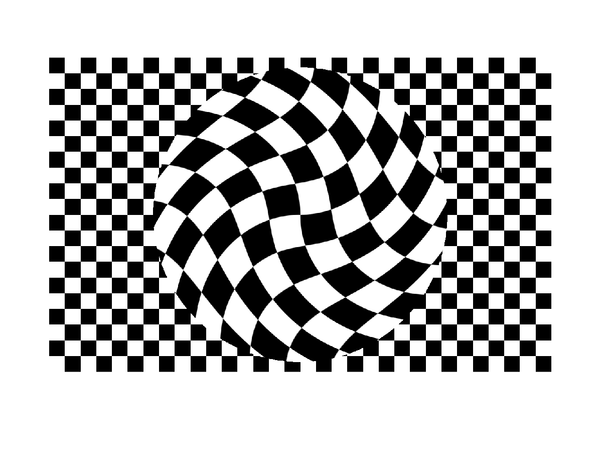

# Step 3: Detect circles from corners with RANSAC
It may seem like a bad idea to use corners to detect circles, but not when the scene looks like this:

To demonstrate the power of RANSAC, we will try to detect the circle above by finding the largest set of inlier points that lies on the circumference of a common circle.

## 8. Finish `CircleEstimator`
Take a look at the class `CircleEstimator` in [lab-corners.py](../lab_corners.py).

Now, read the code in `CircleEstimator._ransac_estimator()`.

The only thing you have to do to make this work is to remove the `break` and perform the correct test in the if-statement.
Do it, and try it out!

Tip: If the program runs really slow, you can manually override the maximum number of RANSAC iterations by setting `max_iterations` in the constructor of `CircleEstimator` to for example 500.

## Play around
Now, the code is finished!

It is now time to play:
- Point the camera towards the chessboard, and see if it is able to detect the circle.
- Play around with the RANSAC parameters, and the feature detection parameters.
  Can you make the detection more stable?
- You should read the rest of the code in `CircleEstimator` to understand how RANSAC is used together with linear least squares to estimate the circle.
